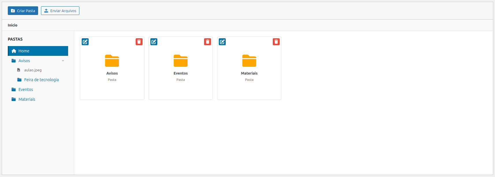
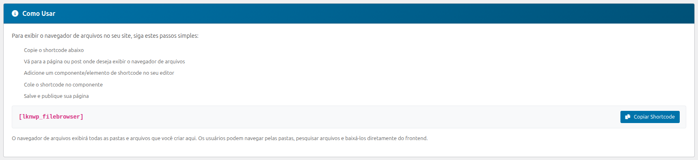
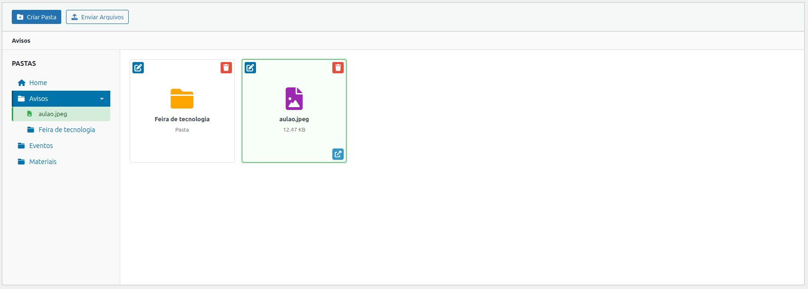
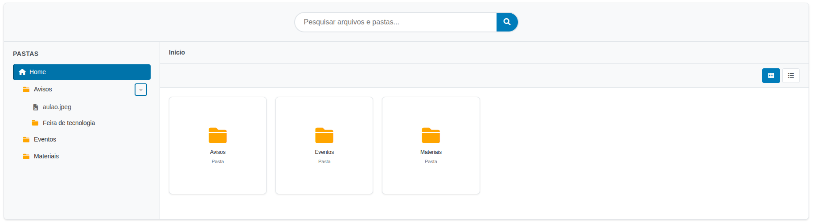
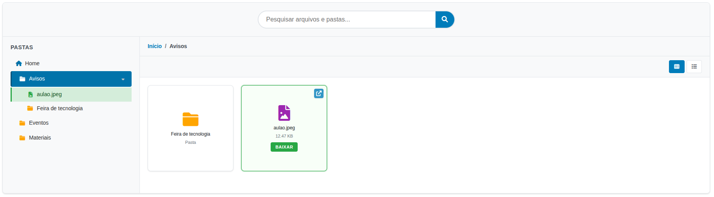
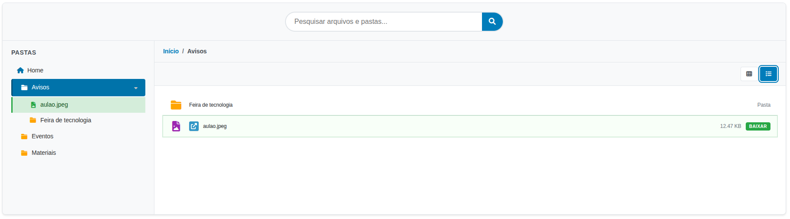
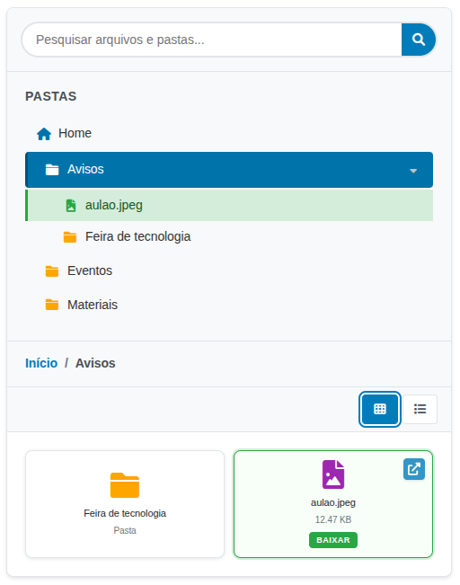

# Link Nacional File Browser

Um plugin [WordPress](https://www.linknacional.com.br/wordpress/) moderno para gerenciamento de arquivos com interface intuitiva e funcionalidades avançadas.

## 🚀 Características

- **Interface Admin Moderna**: Painel administrativo com drag & drop
- **Gerenciamento de Pastas**: Criação, edição e exclusão de pastas
- **Upload de Arquivos**: Suporte a múltiplos formatos
- **Shortcode Frontend**: Exibição de arquivos no frontend
- **Navegador de Pastas**: Árvore de diretórios para navegação rápida
- **Busca Avançada**: Pesquisa em tempo real com contexto de localização
- **PSR-4 Autoloader**: Estrutura moderna de código
- **Responsivo**: Funciona em todos os dispositivos

## 📸 Capturas de Tela

### Painel Administrativo

- Página inicial de configuração  
  

- Como usar  
  

- Selecionando arquivos  
  

### Frontend

- Componente frontend  
  

- Selecionando arquivos (grid)  
  
  
- Selecionando arquivos (lista)  
  

### Mobile
- Modo mobile  
  

## 🛠️ Instalação

1. Faça upload do plugin para `/wp-content/plugins/`
2. Ative o plugin no painel administrativo
3. Configure as permissões necessárias
4. Use o shortcode `[lknwp_filebrowser]` para exibir no frontend

## 📋 Requisitos

- WordPress 5.0+
- PHP 7.4+
- MySQL 5.6+

## 🔧 Tecnologias

- **PSR-4 Autoloading**: Carregamento automático de classes
- **Composer**: Gerenciamento de dependências
- **jQuery**: Interações JavaScript
- **Font Awesome**: Ícones
- **WordPress Coding Standards**: Padrões de código

## 📝 Uso

### Painel Administrativo
Acesse "File Browser" no menu administrativo para:
- Criar e gerenciar pastas
- Fazer upload de arquivos
- Organizar conteúdo
- Visualizar instruções de uso do shortcode
- Copiar shortcodes com um clique

### Como Usar o Shortcode

O plugin inclui um painel de instruções no admin que mostra como usar o shortcode com exemplos práticos e botões para copiar.

#### Uso Básico:
```
[lknwp_filebrowser]
```
Exibe todos os arquivos e pastas da raiz.

#### Pasta Específica:
```
[lknwp_filebrowser folder_id="1"]
```
Exibe arquivos de uma pasta específica. Substitua "1" pelo ID da pasta desejada.

#### Layout Diferente:
```
[lknwp_filebrowser layout="list"]
```
Layouts disponíveis: "grid" (padrão) ou "list".

### Frontend
Use qualquer um dos shortcodes acima em páginas ou posts para exibir o navegador de arquivos.

## 🤝 Contribuição

Desenvolvido pela [Link Nacional](https://www.linknacional.com.br/)

## 📄 Licença

GPL v2 ou posterior - veja [LICENSE.txt](LICENSE.txt) para detalhes.

## 🔗 Links

- [Download do plugin](https://github.com/LinkNacional/lknwp-filebrowser/releases/)
- [Documentação](https://www.linknacional.com.br/wordpress/plugins/)
- [Suporte](https://www.linknacional.com.br/wordpress/suporte/)

---

Made with ❤️ by Link Nacional
